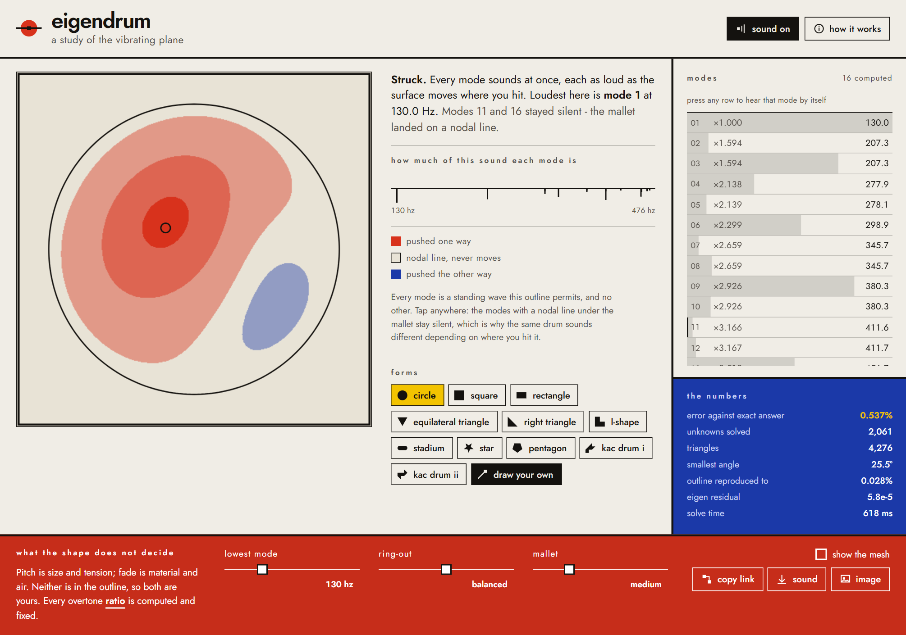
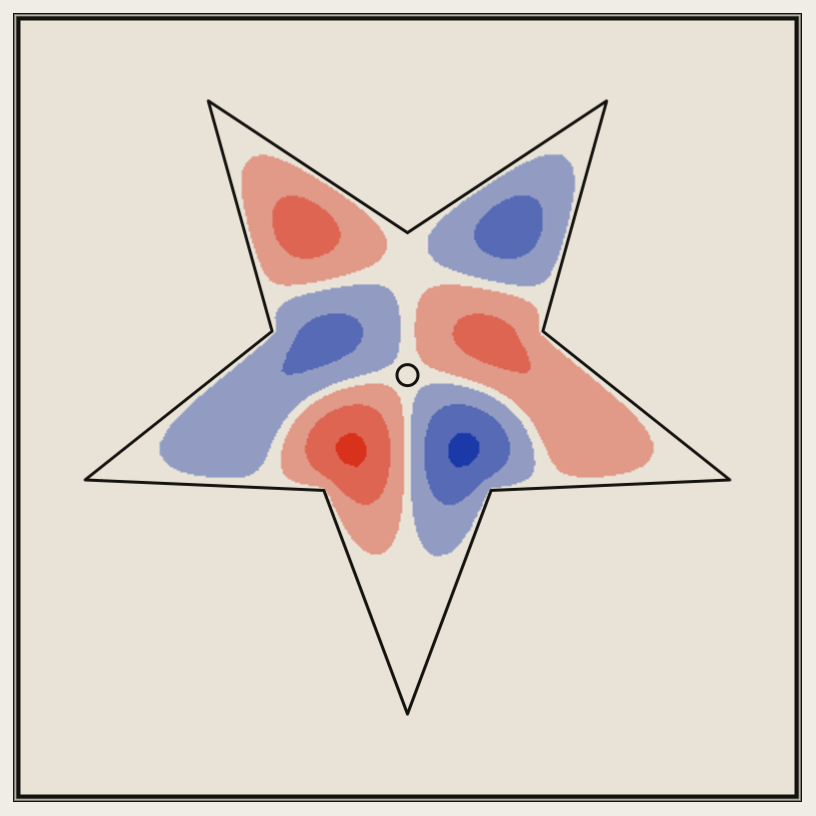
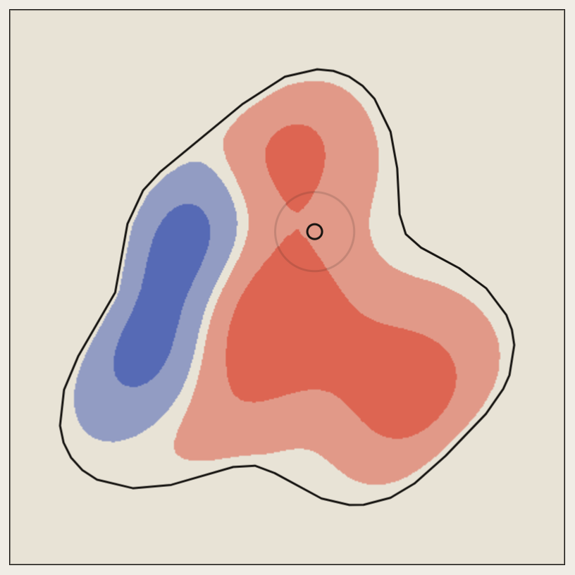
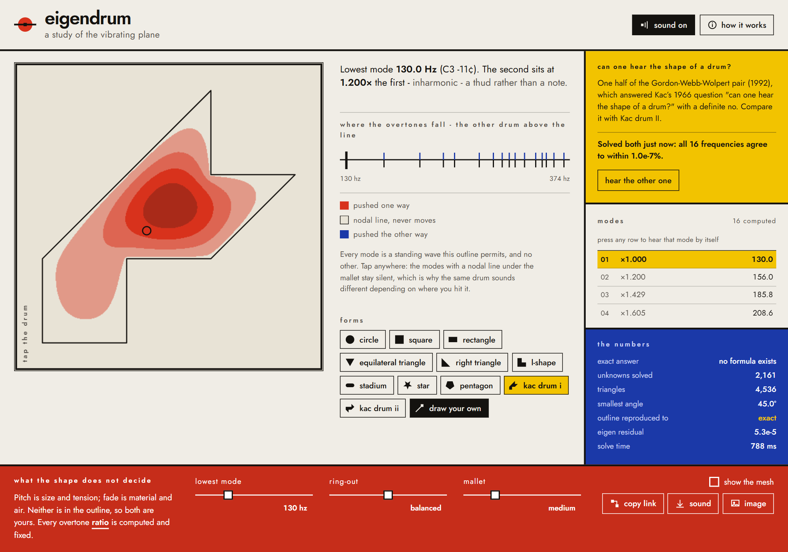

# Eigendrum - Everything is a drum if you put your mind to it

**Draw a shape. Hear the sound it would actually make.**



Eigendrum treats whatever you draw as an ideal drumhead clamped at its rim, solves
the Laplacian eigenvalue problem on that exact region with real finite elements,
and synthesises the frequencies it finds. Nothing is sampled and no overtone is
faked - draw a circle and the overtones come out as ratios of Bessel function
zeros, because that is what a circular drum does.

Then it lets you hit it. Strike different places and the timbre changes, because
striking a spot drives each mode in proportion to how much that mode moves
there. Hit a line where a mode stands still and you cannot excite it at all.

You can also watch it: the real vibration modes ripple across the shape, with pale
channels along the curves where the surface never moves. Those are nodal lines, the
mathematical ancestors of the sand figures Ernst Chladni was drawing in 1787.

<p align="center">
  
  
</p>

<p align="center"><em>Left: mode 9 of a star. Right: something drawn by hand, struck once.<br />Neither has a closed-form spectrum. Both were solved from the outline alone.</em></p>

No dependencies, no build step, no backend. Clone it and open `index.html`, or:

```bash
npm run serve     # http://localhost:8080
npm test          # 35 tests, including the accuracy proofs below
```

## What you can do with it

- **Strike it anywhere.** Click or tap the plate. Where you hit changes the timbre,
  and the readout names the loudest mode along with any that stayed silent because
  the mallet landed on their nodal line.
- **Hear one mode by itself.** Press any row in the mode list. No mallet can do that,
  since a real strike always wakes many modes at once, but it is the only way to hear
  what a single eigenvalue sounds like, and it is what makes the mixture legible
  afterwards.
- **Draw your own outline**, or pick from eleven built-in forms, including both halves
  of the isospectral pair.
- **Retune what the shape does not decide.** Absolute pitch and ring-out are yours.
  Mallet width changes how sharply the strike is localised, and so which modes it can
  reach. The overtone *ratios* are never adjustable, because those belong to the
  outline.
- **See the mesh** the solver actually used, flexing with the membrane.
- **Take it with you.** Copy a link that encodes the shape in the URL fragment, save
  the strike as a `.wav`, or the plate as a `.png`.
- **Keyboard throughout.** Tab to the plate and press Enter or Space to strike it at
  the marked point. Every form, mode and control is reachable and labelled, contrast
  meets WCAG AA, and `prefers-reduced-motion` holds the peak displacement instead of
  animating.

Nothing is uploaded, stored or tracked. There is no backend to upload it to.

## Can one hear the shape of a drum?

Mark Kac asked exactly that in [a famous 1966 paper](https://www.jstor.org/stable/2313748).
If you know every frequency a drumhead can produce, can you deduce its outline?

In 1992 Carolyn Gordon, David Webb and Scott Wolpert answered **no**, by
constructing two different shapes with identical spectra. Both are built into
Eigendrum as *Kac drum I* and *Kac drum II*. Each is made from the same seven
right-isosceles triangles, rearranged. One looks like a hook and the other like an
arrow. They enclose the same area and the same perimeter, and **every single
frequency matches**.



Both drums are solved, and the app reports the agreement it measured rather than
asserting the theorem. The partner drum's spectrum is drawn above the same axis as
this one, so you can see the ticks coincide.

Switch between them and listen. This is not an approximation that happens to come
out close:

```
  k        drum I         drum II    difference
  1     2.54398772     2.54398772        0.00000%
  2     3.66297335     3.66297335        0.00000%
  3     5.19087452     5.19087452        0.00000%
 ...
 12    15.95243552    15.95243552        0.00000%
```

Both drums have only axis-aligned and 45-degree edges on integer coordinates, and
the mesher reproduces both of those directions *exactly*, so the two discrete
problems are isospectral in exact arithmetic too. Run it yourself:

```bash
node tools/isospectral.mjs
```

## The mathematics

A membrane clamped at its boundary can only vibrate in certain shapes at certain
frequencies. They are the solutions of

```
  −∇²u = λu   inside Ω,        u = 0   on ∂Ω
```

Each eigenfunction `u` is a standing wave; each eigenvalue `λ` gives a frequency
proportional to `√λ`. For almost every shape there is no formula, so Eigendrum
solves it numerically:

1. **Mesh.** Overlay a lattice of right-isosceles triangles, keep the triangles
   whose centroid is inside, project the resulting boundary onto the true
   outline, then repair it (slide boundary nodes along the outline to even out
   their spacing, drop the degenerate splinters that snapping leaves behind,
   smooth the interior).
2. **Assemble.** P1 linear elements give the stiffness matrix `K` and the
   consistent mass matrix `M`. Dirichlet conditions are imposed by never
   assembling rows for boundary nodes.
3. **Solve.** The lowest 16 eigenpairs of `Kφ = λMφ`, by block inverse iteration
   with a Rayleigh–Ritz projection. Inverse iteration because we want the
   *bottom* of the spectrum, and plain Lanczos converges to the top.
4. **Listen.** Frequencies from `√λ`, per-mode amplitudes from projecting the
   mallet onto the mode shapes, then a sum of decaying sinusoids.

The step from projection to amplitude is where a struck membrane gets its voice,
and it is easy to get wrong. Three factors apply, and only the last is a choice:

- **Mass normalisation.** `c_k = ∫φ_k g` is the modal coefficient only when the
  modes are orthonormal in the mass inner product. The solver normalises them to
  unit *peak* instead, for the colour map's sake, so the projection is divided by
  `∫φ_k²`. That varies by a factor of about two across the first sixteen modes of
  a disk.
- **`1/ω_k`.** A mallet delivers an impulse of *force*, which sets the membrane's
  initial velocity, not its displacement. Solving `u_k(0) = 0`, `u_k'(0) = a_k`
  gives `u_k(t) = (a_k/ω_k) sin ω_k t`, a 6 dB/octave rolloff.
- **Contact time.** No beater is an impulse. A force pulse lasting `T` cannot pump
  a mode whose period is far shorter than `T`, modelled here as a one-pole rolloff
  fixed at a ratio of the fundamental so the timbre does not shift with the pitch
  control.

Damping is **Rayleigh damping**, `C = αM + βK`, which is the standard proportional
model for a system like this one and in modal coordinates reads
`1/τ_k = α + βω_k²`. Loss growing with the *square* of frequency is why a drum's
high inharmonic partials vanish in tens of milliseconds while the fundamental
rings on, and that fast darkening is most of what makes a drum read as a pitched
thud rather than a chord. The brightness control moves weight between the two
terms.

The eigensolver needs a few hundred solves of `K y = b`, so `K` is reordered with
reverse Cuthill–McKee and factorised once with a banded Cholesky. After that each
solve is two triangular sweeps. A 2000-unknown drum solves in about 700 ms in a
browser worker.

## Why you can trust the numbers

A handful of shapes have spectra that can be written in closed form, and the test
suite checks the solver against them on every change. This is measured, not
asserted - reproduce it with `npm run bench`:

| shape | exact spectrum | 1200 nodes | 2600 | 6000 |
| --- | --- | --- | --- | --- |
| unit square | `π²(m² + n²)` | 0.846% | 0.375% | 0.160% |
| rectangle 1.5 × 0.8 | `π²(m²/a² + n²/b²)` | 1.141% | 0.548% | 0.233% |
| right triangle | square modes with `m ≠ n` | 1.103% | 0.519% | 0.227% |
| unit disk | squared zeros of `J_m` | 0.946% | 0.437% | 0.192% |

Worst relative error over the lowest 8 modes. The errors fall in the ratio
1 : 0.47 : 0.21 against predicted `h²` ratios of 1 : 0.471 : 0.207 - clean
second-order convergence.

Two further checks worth naming:

- **Every error is positive.** A conforming finite element method minimises the
  Rayleigh quotient over a subspace of the true space, so it can never
  undershoot. An eigenvalue below the exact one would mean a bug, not a coarse
  mesh, and the suite asserts it never happens.
- **The strike model reproduces physics nobody coded in.** Striking a circle dead
  centre excites the radially symmetric fundamental hard but leaves the next two
  modes essentially silent, because they have a nodal diameter straight through
  the centre. That falls out of the projection, and it is a test.

## Physics versus modelling choice

Being clear about this is the point of the project:

**Determined by the shape, and not adjustable.** The frequency *ratios*. The mode
shapes. Which modes a given strike position can excite.

**Not determined by the shape, so exposed as controls.** Absolute pitch (that is
size and tension). How fast each overtone fades (material and air). Shapes are
scaled to equal area before solving, so what you hear is shape rather than size.

**Modelled, and neither of the above.** The mallet: its width, which is a control,
and its contact time, which is fixed. Both decide how much of each mode a strike
can reach, never at what frequency a mode sits.

## Layout

```
index.html    the whole page: shell markup and the About dialog, no logic
styles/       all styling, plus the typeface as a base64 data URI
src/math/     linalg, sparse CSR, banded Cholesky + RCM, eigensolver, Bessel,
              closed-form spectra
src/geom/     polygon utilities, the mesher
src/fem/      P1 assembly, and the pipeline that ties it together
src/audio/    modal synthesis, WAV encoding, note naming
src/app/      DOM, canvas rendering, input, presets, sharing
src/worker/   runs the mesher and solver off the main thread
tools/        dev server, accuracy bench, isospectral check, browser smoke tests
tests/        node --test
docs/         the images this README embeds
```

`src/math`, `src/geom` and `src/fem` never touch the DOM, which is why they can be
tested in Node and run in a worker. The worker owns every expensive step, so the
interface stays responsive while a drum solves.

The typeface is embedded as a data URI rather than linked, because Chrome refuses
font subresources over `file://` and this has to work from a bare filesystem.

## Working on it

```bash
npm run serve         # dev server on :8080
npm test              # unit tests, including the accuracy proofs
npm run bench         # accuracy and timing against closed-form spectra
npm run isospectral   # verifies the two Kac drums really are isospectral
npm run smoke         # headless browser test of the whole app
npm run mobile        # narrow-viewport layout and touch checks
npm run readme-shots  # regenerates the images above
```

Puppeteer is a dev dependency, used only by the browser tests, and never loads in
the browser. The shipped app has zero runtime dependencies in the literal sense:
every import and every asset reference in `index.html`, `styles/` and `src/`
resolves inside this repo, with no network fetch at any point.

## Deploying

Copy the repo to any static host. There is no build step, no server-side anything,
and no environment to configure. GitHub Pages, Netlify, S3, a USB stick.

## References

- M. Kac, *Can One Hear the Shape of a Drum?*, American Mathematical Monthly 73
  (1966). [JSTOR](https://www.jstor.org/stable/2313748)
- C. Gordon, D. Webb, S. Wolpert, *One cannot hear the shape of a drum*, Bulletin
  of the AMS 27 (1992).
- T. Driscoll, *Eigenmodes of Isospectral Drums*, SIAM Review 39 (1997).
  [SIAM](https://epubs.siam.org/doi/abs/10.1137/S0036144595285069) - the source of
  the coordinates used for the two Kac drums.
- [Hearing the shape of a drum](https://en.wikipedia.org/wiki/Hearing_the_shape_of_a_drum)
  on Wikipedia, for the wider history.

## Licence

MIT. See [LICENSE](LICENSE).
